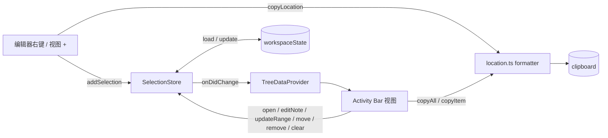

# Selection Clipboard VS Code 扩展

Status: Implemented (T0.1–T3.5); manual VS Code verification pending
Created: 2026-09-23
Approval: Approved 2026-09-23 for T0.1–T3.5 (user: "执行计划"); T4.1 not selected

## Summary

新增独立扩展 `extensions/selection-clipboard`（显示名 **Selection Clipboard / 选区剪贴板**），提供两项能力：

1. **右键复制精准选区位置**：编辑器右键菜单（紧邻「复制」的 `9_cutcopypaste` 组）新增「复制选区位置」，把当前选区复制为
   `src/app/foo.ts:12:5-14:20`（工作区相对路径 + 1-based 起止行列）。多光标时每个选区一行；空选区复制光标位置 `src/app/foo.ts:12:5`。
2. **可 CRUD 的选区收集列表**：独立 Activity Bar 视图里的原生 TreeView。
   - **Create**：右键「添加选区到列表」，或视图标题栏的 `+`。
   - **Read**：点击条目跳转并重新选中该区间；tooltip 预览代码快照。
   - **Update**：编辑备注；用当前选区替换条目区间；上移/下移。
   - **Delete**：单条删除、多选删除、清空（弹窗确认）。
   - **一键复制**：视图标题栏「复制全部」按列表顺序把所有位置复制为多行文本；也可以只复制选中的条目。

列表按工作区持久化（`workspaceState`），条目是**快照语义**：行列号和代码文本都固定为收集时的值，不跟随后续编辑。

## Clarifying Questions

- [x] 默认位置格式？→ **行+列精确** `path:startLine:startCol-endLine:endCol`。另提供配置可切换为仅行号 / GitHub 锚点风格，以及是否附带代码块。
- [x] 列表形态与持久化范围？→ **原生 TreeView + 按工作区保存**（`workspaceState`）。
- [x] 文件被编辑后的位置处理？→ **快照，不跟随**。跳转时若超出文件范围，裁剪到文件末尾。
- [x] 新插件还是并入 git-toolkit？→ 用户明确要求「新增一个插件」，所以做成独立扩展，并用 ADR 0004 记录这次从单产品回到多扩展 workspace 的变化。
- [ ] （非阻塞，实现时按默认值走）默认快捷键：默认**不**绑定，避免和用户已有键位冲突；README 里说明如何自绑。
- [ ] （非阻塞，需单独确认）`release.yml` 是否在本次同时支持 `selection-clipboard-v*` tag 发布。默认**不**包含在本次选中的任务里，见 Phase 4。

## File And Code References

### 需要沿用的现有约定（来源：git-toolkit）

- 包清单模板：[extensions/git-toolkit/package.json](../../extensions/git-toolkit/package.json)
  - `publisher: "vscode-plugins"`、`main: "./dist/extension.js"`、`engines.vscode: "^1.105.0"`、`l10n: "./l10n"`。
  - 所有 devDependencies 精确锁版本：`@types/vscode 1.105.0`、`@vscode/vsce 3.9.2`、`rolldown 1.2.6`、`typescript 7.0.2`、`vitest 4.1.11`、`oxlint 1.80.0`、`oxfmt 0.65.0`、`@vitest/coverage-v8 4.1.11`。
  - scripts 的写法：`build`、`clean`、`dev`、`format`、`format:check`、`lint`、`package:vsix`、`test`、`test:coverage`、`typecheck`。
  - 命令 ID 前缀是 `vscode-plugins-<name>.<verb>`，例如 [package.json:49](../../extensions/git-toolkit/package.json:49)。
  - `activationEvents` 显式列出，并由 manifest 测试校验与命令一一对应。
- 构建配置 [extensions/git-toolkit/rolldown.config.mjs](../../extensions/git-toolkit/rolldown.config.mjs)：只复制第一个 entry（`src/extension.ts` → `dist/extension.js`，cjs，`external: ["vscode"]`）。第二个 entry 构建 webview，本扩展用不到。
- [extensions/git-toolkit/tsconfig.json](../../extensions/git-toolkit/tsconfig.json) 和 [vitest.config.ts](../../extensions/git-toolkit/vitest.config.ts) 原样复制。
  - [tsconfig.base.json](../../tsconfig.base.json) 开启了 `exactOptionalPropertyTypes`、`noUncheckedIndexedAccess`、`verbatimModuleSyntax`。可选字段要用条件展开写法，参考 [src/extension.ts:88](../../extensions/git-toolkit/src/extension.ts:88)。
- [extensions/git-toolkit/.vscodeignore](../../extensions/git-toolkit/.vscodeignore) 原样复制。
- 入口与命令注册：[extensions/git-toolkit/src/extension.ts](../../extensions/git-toolkit/src/extension.ts) 在 `activate` 里构造依赖，一次 `context.subscriptions.push(...)` 注册全部命令；命令常量集中在 [src/protocol.ts](../../extensions/git-toolkit/src/protocol.ts)。
- 剪贴板写入 `vscode.env.clipboard.writeText`：[src/panel.ts:150](../../extensions/git-toolkit/src/panel.ts:150)。
- 本地化：
  - manifest 字符串放 `package.nls.json` / `package.nls.zh-cn.json`。
  - 运行时字符串放 `l10n/bundle.l10n.json` / `bundle.l10n.zh-cn.json`，key 用英文原文，占位符用 `{name}`。
- 测试写法：
  - 每个测试文件内联 `vi.mock("vscode", ...)`，需要时配合 `vi.hoisted`。模板见 [test/extension.test.ts:12](../../extensions/git-toolkit/test/extension.test.ts:12)。
  - [test/manifest.test.ts](../../extensions/git-toolkit/test/manifest.test.ts) 校验命令、激活事件、菜单和配置前缀。
- 仓库规则 [AGENTS.md](../../AGENTS.md)：
  - 测试只放 `test/`。
  - 只用 Oxc / Rolldown / Vitest。
  - 不要把可变状态放在模块作用域。
  - 公共契约（命令、贡献点）变更要有测试。
  - 重要的 build-vs-reuse 决策要写 ADR。

### 复用检查结论

- git-toolkit 里没有 TreeDataProvider，也没有 `workspaceState` 用法或行列格式化逻辑可复用；`packages/*` 目前为空。
- 位置格式化只有这一个消费者，按 AGENTS.md 放在扩展本地，不建 shared package。
- 相对路径用 `vscode.workspace.asRelativePath(uri, multiRoot)`，不用 git-toolkit 的 `path.relative`（[src/panel.ts:196](../../extensions/git-toolkit/src/panel.ts:196)）。这是有意的分歧：前者原生支持 multi-root 前缀，也能处理工作区外文件。

### 仓库中硬编码 git-toolkit、需要调整的位置

- [scripts/verify-vsix.mjs:86-91](../../scripts/verify-vsix.mjs:86)：无条件要求 `dist/webview/diff-preview.js` 和 `dist/webview/main.js`，**不改会导致新扩展校验失败**。
- [package.json](../../package.json)：
  - `description` 只提到 Git Toolkit。
  - `verify:vsix` 只校验 git-toolkit。
  - 只有 `release:git-toolkit:*` 三个 release 脚本。
- [.github/workflows/ci.yml:51-62](../../.github/workflows/ci.yml:51)：VSIX 校验和 artifact 上传只覆盖 git-toolkit。
- [.github/workflows/release.yml:6](../../.github/workflows/release.yml:6)、`:39-46`、`:184-197`：tag 过滤、extension 名和首发说明都写死为 git-toolkit（归入 Phase 4，需单独确认）。
- 文档与元数据：
  - [README.md](../../README.md) 的 workspace 表、命令表、发布章节。
  - [CONTRIBUTING.md](../../CONTRIBUTING.md) 第 6 行和第 35-41 行。
  - [.github/CODEOWNERS](../../.github/CODEOWNERS)。
  - `.github/ISSUE_TEMPLATE/bug-report.yml`、`feature-request.yml` 的产品下拉。
- [docs/adr/0003-consolidate-git-toolkit.md](../../docs/adr/0003-consolidate-git-toolkit.md) 记录的是「单产品单 VSIX」。新增扩展要写 ADR 0004 说明新的边界，不改 0003。
- 无需改动：`pnpm-workspace.yaml`（已包含 `extensions/*`）、`turbo.json`、`.gitignore`、`.oxlintrc.json`、`.oxfmtrc.json`、`commitlint.config.cjs`（未限制 scope）。

### 新扩展目标结构

```text
extensions/selection-clipboard/
  package.json                 # 清单、贡献点、scripts、devDependencies
  package.nls.json             # 英文 manifest 字符串
  package.nls.zh-cn.json       # 中文 manifest 字符串
  l10n/bundle.l10n.json        # 运行时英文字符串
  l10n/bundle.l10n.zh-cn.json  # 运行时中文字符串
  media/selection-clipboard.svg  # Activity Bar 单色图标
  README.md  LICENSE.txt  THIRD_PARTY_NOTICES.md  .vscodeignore
  rolldown.config.mjs  tsconfig.json  vitest.config.ts
  src/
    extension.ts     # activate：构造 store/provider，注册命令和视图
    protocol.ts      # 命令 ID、视图 ID、状态 key、配置 key 常量
    location.ts      # 纯函数：区间归一化与格式化（不 import vscode）
    store.ts         # SelectionStore：CRUD、持久化、校验、变更事件
    treeProvider.ts  # TreeDataProvider：条目渲染与 tooltip
    commands.ts      # 各命令 handler
    config.ts        # 读取 selectionClipboard.* 配置
  test/
    location.test.ts  store.test.ts  treeProvider.test.ts
    commands.test.ts  extension.test.ts  manifest.test.ts
```

### 核心契约

位置格式化规则（`location.ts`，纯函数）：

- 行号 = `line + 1`。起始列 = `character + 1`。结束列 = `end.character`，即把 0-based 开区间换算成 1-based 闭区间。
  - 列按 UTF-16 字符偏移计算，和 VS Code API 一致。**不做 tab 可视宽度展开**，这一点在 README 说明。
- 若选区结束在下一行第 0 列（例如整行选中、shift+↓），先把终点收回到上一行行尾，避免多算一行。
  - 如果那一行为空，结束列记为 `1`。
- 空选区只输出单点：`path:12:5`。
- `locationStyle` 配置：
  - `lineColumn`（默认）→ `path:12:5-14:20`
  - `lineRange` → 单行 `path:12`，多行 `path:12-14`
  - `githubAnchor` → `path#L12C5-L14C20`
- `pathStyle` 配置：
  - `workspaceRelative`（默认）：multi-root 时带文件夹名前缀；工作区外文件回退为绝对路径；untitled 文件使用其标题。
  - `absolute`：始终用绝对路径。
- `includeCode`（默认 `false`）：为 `true` 时在位置下方追加以 languageId 标注的 fenced 代码块；复制全部时条目之间用空行分隔。
- 多光标：按文档顺序排序后逐行输出。

持久化格式（`store.ts`）：

- `workspaceState` 的 key 为 `selectionClipboard.items`，值为 `{ version: 1, items: SelectionItem[] }`。
- `SelectionItem` 字段：
  - `id`：`crypto.randomUUID()`
  - `uri`：字符串形式
  - `range`：`{ startLine, startCharacter, endLine, endCharacter }`，0-based；存归一化后的区间（整行选区已收回到上一行行尾），与复制输出、跳转选区一致
  - `text`：代码快照，最多 20,000 字符，超出截断并标记 `truncated`
  - `languageId`
  - `note?`
  - `createdAt`
- 显示格式在渲染和复制时根据当前配置计算，所以修改配置会立即作用于已有条目。
- 加载时逐条校验；不合法的条目丢弃，不让整个列表崩溃。未知 `version` 的数据保持原样，不覆盖。
- 同一 uri + range 重复添加时不新增，只在状态栏提示「已在列表中」。新条目追加到末尾，保持收集顺序。



### 贡献点清单（公共契约）

命令前缀为 `vscode-plugins-selection-clipboard.`，配置前缀为 `selectionClipboard.`：

| 命令 | 标题（en / zh-cn） | 出现位置 |
| --- | --- | --- |
| `copyLocation` | Copy Selection Location / 复制选区位置 | `editor/context` `9_cutcopypaste@100`、命令面板 |
| `addSelection` | Add Selection to List / 添加选区到列表 | `editor/context` `9_cutcopypaste@101`、view/title `$(add)`、命令面板 |
| `copyAll` | Copy All Locations / 复制全部位置 | view/title navigation `$(copy)`、命令面板 |
| `clearAll` | Clear List / 清空列表 | view/title `$(clear-all)`（弹窗确认） |
| `openItem` | Go to Selection / 跳转到选区 | 条目点击（在命令面板中隐藏） |
| `copyItem` | Copy Location / 复制位置 | 条目 inline `$(copy)`；多选时复制所有选中条目 |
| `editNote` | Edit Note / 编辑备注 | 条目 inline `$(edit)` |
| `updateRange` | Replace with Current Selection / 用当前选区替换 | 条目右键菜单 |
| `moveUp` / `moveDown` | Move Up / Move Down / 上移 / 下移 | 条目右键菜单 |
| `removeItem` | Remove / 删除 | 条目 inline `$(close)`；多选时批量删除 |

视图与配置：

- 视图容器：`viewsContainers.activitybar` 的 id 为 `selectionClipboard`，图标使用 `media/selection-clipboard.svg`。
- 视图：id 为 `selectionClipboard.items`，`canSelectMany: true`；`badge` 显示条目数；`viewsWelcome` 在空列表时提供「添加当前选区」按钮。
- 配置：`selectionClipboard.locationStyle`、`selectionClipboard.pathStyle`、`selectionClipboard.includeCode`。

## Plan Todos

### Phase 0 — 契约与脚手架（root 负责，先完成）

- [x] T0.1 新建 `extensions/selection-clipboard/` 脚手架：
  - `package.json`：identity、scripts、devDependencies 与 git-toolkit 版本对齐。
  - `tsconfig.json`、`vitest.config.ts`、`rolldown.config.mjs`（单 entry）、`.vscodeignore`。
  - `LICENSE.txt`（复制 git-toolkit 的版权声明）、`THIRD_PARTY_NOTICES.md`（声明不打包第三方运行时代码）。
  - 在根目录执行 `pnpm install` 更新 `pnpm-lock.yaml`。
- [x] T0.2 写 `src/protocol.ts`：命令 ID、视图 ID、状态 key、配置 key 常量，以及 `SelectionItem` / `SelectionRange` / `LocationStyle` / `PathStyle` 类型。**后续 worker 都消费这个冻结契约。**

### Phase 1 — 并行实现（依赖 T0.2）

- [x] T1.1 `src/location.ts` + `test/location.test.ts`：纯函数 `normalizeRange`、`formatLocation`、`formatEntry`、`formatEntries`。测试覆盖：
  - 空选区、单行、多行、跨行结束在第 0 列、上一行为空。
  - 三种 style、includeCode 开关、多光标排序。
  - 包含 emoji / CJK 的 UTF-16 列计算。
- [x] T1.2 `src/store.ts` + `test/store.test.ts`：
  - `SelectionStore(memento)` 提供 `list`、`add`（去重）、`updateNote`、`replaceRange`、`move(id, ±1)`、`remove(ids)`、`clear`，以及 `onDidChange` 事件。
  - 加载时校验：丢弃坏条目，未知 version 不覆盖。
  - 文本快照截断。
  - 使用 mock Memento 测试。
- [x] T1.3 manifest 与本地化：
  - `package.json` 的 `contributes`：commands、menus（`editor/context`、`view/title`、`view/item/context`、`commandPalette` 隐藏条目命令）、viewsContainers、views、viewsWelcome、configuration。
  - 显式 `activationEvents`（全部 `onCommand:*` 加 `onView:selectionClipboard.items`）。
  - `package.nls*.json`、`l10n/bundle.l10n*.json`（en / zh-cn）、`media/selection-clipboard.svg`。
  - `test/manifest.test.ts`：命令与激活事件一一对应、菜单引用的命令都已声明、配置前缀、视图 id 一致。

### Phase 2 — 集成（依赖 T1.1–T1.3）

- [x] T2.1 `src/treeProvider.ts` + `test/treeProvider.test.ts`：
  - 条目 label 为 `basename:range`；description 为备注，没有备注时显示相对目录。
  - `resourceUri` 让条目显示文件图标。
  - tooltip 用 MarkdownString，包含完整路径和代码快照。
  - `contextValue` 为 `selectionItem`；点击绑定 `openItem`。
- [x] T2.2 `src/commands.ts` + `src/config.ts` + `test/commands.test.ts`，各命令 handler：
  - 没有活动编辑器时给出 l10n 提示。
  - `openItem`：打开文档，把区间裁剪到当前文件范围，然后设置 selection 并 `revealRange`。
  - `editNote`：用 `showInputBox`，预填现有备注；输入空字符串表示清除备注。
  - `clearAll`：弹 modal 确认。
  - `copyAll` 在列表为空时给出提示。
  - 多选参数签名为 `(item, selected?)`。
  - 复制成功后通过状态栏提示复制了几条。
- [x] T2.3 `src/extension.ts` + `test/extension.test.ts`：
  - `activate` 构造 store / provider / treeView（含 badge），注册全部命令，并监听配置变化来刷新视图。
  - 不使用模块级可变状态。
  - 测试断言每个命令都已注册，以及 subscriptions 的数量。
- [x] T2.4 扩展 `README.md`：功能、命令表、配置、列号语义（UTF-16 偏移、非 tab 可视列）、快照语义、如何自绑快捷键，中英文均可按 git-toolkit README 风格。

### Phase 3 — 仓库级接入（可与 Phase 1/2 并行，写入范围与扩展目录不重叠）

- [x] T3.1 `scripts/verify-vsix.mjs`：把 webview 必需项改为按扩展名配置，例如 `EXTRA_REQUIRED_ENTRIES = { "git-toolkit": [...] }`。git-toolkit 的校验行为保持不变。
- [x] T3.2 根 `package.json`：
  - 更新 `description`。
  - `verify:vsix` 同时校验两个扩展目录。
  - 新增 `release:selection-clipboard:{major,minor,patch}`，tag 前缀为 `selection-clipboard-v`。
- [x] T3.3 `.github/workflows/ci.yml`：VSIX 校验与 artifact 上传覆盖新扩展。
- [x] T3.4 文档与元数据：
  - `README.md` 的 workspace 表加一行，并把单产品表述改为多扩展。
  - `CONTRIBUTING.md` 把「只在 git-toolkit 内」改为「在对应扩展内」。
  - `.github/CODEOWNERS` 加一行。
  - issue 模板的产品下拉加上 Selection Clipboard。
- [x] T3.5 `docs/adr/0004-add-selection-clipboard-extension.md`：记录为什么做成独立扩展而不并入 git-toolkit（领域不同、没有共享依赖、需要独立发布节奏），ADR 0003 的「单产品」边界如何演进，备选方案，后果，以及复审日期。

### Phase 4 — 发布流水线（**默认不选中，需要用户单独确认**）

- [ ] T4.1 `.github/workflows/release.yml`：
  - tag 过滤增加 `selection-clipboard-v*`。
  - tag → 扩展目录 / 显示名映射。
  - 首发说明按扩展区分，git-toolkit 的迁移文案只用于 git-toolkit。

## Grill-Me Outcome

- Transcript: Not run — 三个关键产品决策已经通过结构化问答确定（见 Clarifying Questions），剩余选择都有低风险默认值。
- Outcome: Not run
- Summary: 不需要额外访谈。

## Build From Plan

- Ready to build: Yes（Phase 0–3）；Phase 4 需要单独确认。
- Selected todos: 批准后默认执行 T0.1–T3.5；T4.1 除非用户明确选中，否则不执行。
- Execution notes:
  - 按 multitask-coordinator 调度，root 负责 Phase 0 契约（`protocol.ts` 和 package.json 骨架）并冻结后再派发。
  - Phase 1 可以并行派 3 个 worker，写入范围互不重叠：
    - T1.1 只写 `src/location.ts` 和 `test/location.test.ts`。
    - T1.2 只写 `src/store.ts` 和 `test/store.test.ts`。
    - T1.3 独占 `package.json` 的 `contributes` / `activationEvents`、nls、l10n、media 以及 `test/manifest.test.ts`。
  - Phase 3 的 worker 只写仓库根和 `.github` / `docs` / `scripts`，可以和 Phase 1/2 同时进行。
  - Phase 2 需要同时读 store 和 formatter 的实现，耦合较紧，由一个 worker 串行完成 T2.1–T2.3。T2.4 由 T1.3 的 worker 或 root 收尾。
  - `pnpm-lock.yaml` 只由 root 在 T0.1 修改一次。
  - 不暂存、不提交、不推送，除非用户另行要求。

## Validation

- 自动化（根目录）：`pnpm install --frozen-lockfile` 验证 lockfile 一致，然后跑 `pnpm check`（format:check、lint、typecheck、test、build 覆盖两个扩展）。
- 打包与校验：
  - `pnpm package:vsix`
  - `node scripts/verify-vsix.mjs extensions/git-toolkit extensions/selection-clipboard`
  - 确认 git-toolkit 的校验结果不回归。
- 手动验证：`code --install-extension extensions/selection-clipboard/selection-clipboard-0.0.1.vsix --force`，然后逐项检查：
  1. 单行、多行、整行（shift+↓）、空选区、多光标下右键「复制选区位置」的输出。
  2. multi-root 工作区、工作区外文件和 untitled 文件的路径。
  3. 添加、重复添加、编辑备注、用当前选区替换、上移下移、多选删除、清空确认。
  4. 复制全部（包括 `includeCode` 开和关）。
  5. 重启窗口后列表仍在；切换到另一个工作区时列表相互独立。
  6. 文件被截短后点击条目，区间被裁剪、不报错。
  7. 中文界面下的菜单和提示。

## Risks

- **列号语义误解**：VS Code 状态栏的 Col 会展开 tab，而本扩展按字符偏移计算，含 tab 的行两者会不一致。缓解：README 明确说明；如有需要，后续可以加 `columnMode: visual` 配置。
- **快照漂移**：文件被编辑后位置失效是已接受的产品取舍。条目上保留收集时间和代码快照，便于人工核对。
- **`workspaceState` 体积**：条目很多且代码很大时会膨胀。每条快照上限 20,000 字符；如确有需要再加条目数上限。
- **verify-vsix 改动回归**：T3.1 需要在改动前后都对 git-toolkit 跑一次校验来对比。
- **仓库定位变化**：README / ADR 0003 目前以单产品叙事，T3.4 / T3.5 要避免与 ADR 0003 的已接受决策矛盾，所以新写 ADR，不改写旧 ADR。
- **Activity Bar 图标**：`viewsContainers` 需要提供图标文件（本计划不依赖 codicon 语法），要手动确认深色和浅色主题下都清晰可见。

## Approval

- Status: Approved; T0.1–T3.5 implemented
- Authorized scope: T0.1–T3.5；不含 T4.1；不暂存/提交/推送。
- Pending decision: T4.1（发布流水线）仍需单独确认。

## Execution Record

- 2026-09-23: T0.1–T3.5 implemented. Automated evidence:
  - `pnpm check` passes: format, lint, typecheck, test, build. selection-clipboard: 7 files / 137 tests; git-toolkit: 15 files / 51 tests.
  - `pnpm package:vsix` + `pnpm verify:vsix`: `selection-clipboard-0.0.1.vsix` (12 files, 0.02 MiB) and `git-toolkit-0.1.0.vsix` (335 files) both verified.
- Implementation deviation: stored ranges are normalized (see 持久化格式).
- Not done: the manual checklist in Validation has not been run in a real VS Code window; T4.1 not selected.
- Known gaps:
  - With `includeCode`, copying an item whose snapshot was truncated at 20,000 characters gives no marker in the clipboard text. The tooltip does show it.
  - `replaceSelection` can create a duplicate uri+range item.
- 2026-09-23 follow-up (user request): the editor right-click entries moved into a submenu, `selectionClipboard.editorContext` (label 选区剪贴板 / Selection Clipboard), containing copyLocation `1_copy@1` and addSelection `2_collect@1`. The submenu itself sits in the `9_cutcopypaste@100` group. The product name moved from the command titles into `category: %command.category%`, so the Command Palette still shows "选区剪贴板: …" while submenu items stay short. `pnpm check` and `verify:vsix` pass.
